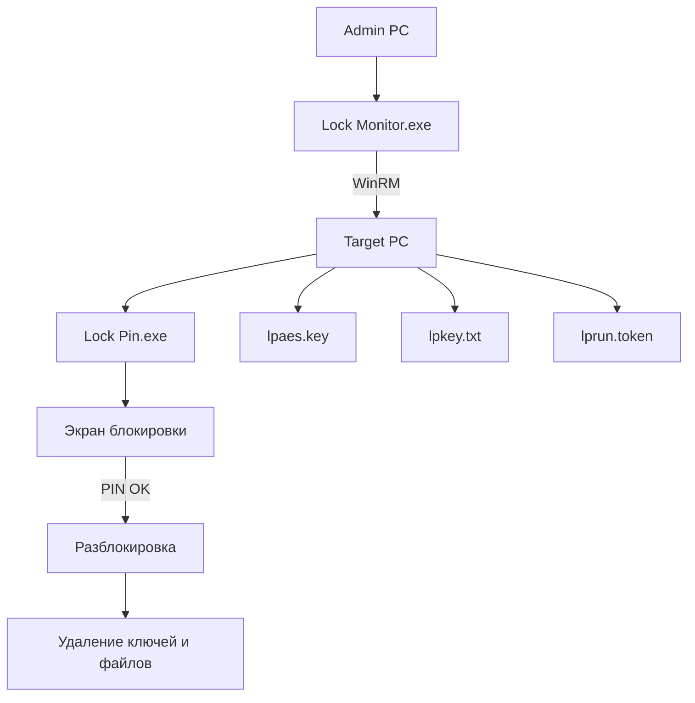

# Lock Monitor


Удалённая блокировка экрана пользовательской сессии.

Позволяет администратору мгновенно ограничить доступ к рабочему месту пользователя
и автоматически восстановить блокировку после перезагрузки системы.

---

# 📑 Оглавление

* [Описание](#описание)
* [Архитектура работы](#архитектура-работы)
* [Требования](#требования)
* [Состав файлов](#состав-файлов)
* [Механика работы скриптов](#механика-работы-скриптов)

  * [LockPinAESKey.ps1](#1-lockpinaeskeyps1)
  * [Lock-Monitor.ps1](#2-lock-monitorps1)
  * [Lock-Pin.ps1](#3-lock-pinps1)
* [Сборка в EXE](#сборка-в-exe)

---

# Описание

Набор PowerShell-скриптов предназначен для **удалённой блокировки экрана пользовательской сессии** на сервере или рабочей станции до ввода PIN-кода.

Особенности:

* 🔐 PIN передаётся в зашифрованном виде (`AES + SecureString`)
* 🔁 блокировка переживает **перезагрузку системы**
* 👤 работает только для **конкретной пользовательской сессии**
* 🧹 после разблокировки выполняется **полная очистка временных файлов**
* 🛡 защита от закрытия через Task Manager и горячие клавиши

---

# Архитектура работы



---

# Требования

|   Требование   | Описание |
|----------------|----------|
| **WinRM**      | Должна быть настроена служба Windows Remote Management для удалённого выполнения.<br>[Документация Microsoft](https://learn.microsoft.com/ru-ru/windows/win32/winrm/portal) |
| **PowerShell 5.1** | Политика выполнения должна разрешать запуск скриптов.<br>[Документация Microsoft](https://learn.microsoft.com/ru-ru/powershell/module/microsoft.powershell.core/about/about_execution_policies?view=powershell-7.5) |
|**RSAT-AD-PowerShell** | Средства удаленного администрирования сервера для Windows.<br>[Документация Microsoft](https://learn.microsoft.com/ru-ru/troubleshoot/windows-server/system-management-components/remote-server-administration-tools)|
|**Win-PS2EXE**| Компилирует скрипты PowerShell в исполняемые файлы.<br>[Инструкция](https://github.com/MScholtes/PS2EXE)|

---

# Состав файлов

| Файл                | Назначение           |
| ------------------- | -------------------- |
| `LockPinAESKey.ps1` | генерация AES ключа  |
| `Lock-Monitor.ps1`  | удалённая блокировка |
| `Lock-Pin.ps1`      | экран блокировки     |
| `picture.png` | картинка  |

---

# Механика работы скриптов

## LockPinAESKey.ps1

Скрипт генерации ключа шифрования.

⚠ **ВАЖНО:**
требуется указать имя машины в параметре `sourceSRV`, где хранится папка со скриптом.

Что делает:

* создаёт случайный **AES-256 ключ**
* сохраняет ключ в `\\$($sourceSRV)\Lock_Pin\lpaes.key`
* формирует резервную копию ключа
* показывает оператору подтверждение создания ключа

Результат: 
создаётся файл `lpaes.key ` который используется в остальных скриптах.

---

## Lock-Monitor.ps1

Управляющий скрипт удалённой блокировки и мониторинга.

Запускается как 

```
Lock Monitor.exe
```

⚠ **ВАЖНО:**
требуется указать имя машины в параметре `sourceSRV`, где хранится папка со скриптом.

⚠ **ВАЖНО:**
требуется указать название изображения PNG, например `picture.png`

Картинка должна лежать **в одной папке со скриптами на сервере-источнике**.

---

### Что делает скрипт

1️⃣ запрашивает сервер и пользователя

2️⃣ проверяет пользователя через **Active Directory**

3️⃣ генерирует PIN

4️⃣ шифрует PIN через **AES-256**

5️⃣ копирует на удалённую машину:

```
Lock Pin.exe
picture.png
lpaes.key
lpkey.txt
lprun.token
```

6️⃣ создаёт **Scheduled Task**

7️⃣ запускает блокировку

---

### Мониторинг

Скрипт постоянно отслеживает:

* перезагрузку удалённой машины
* активность пользователя
* остановку процесса блокировки

Если блокировщик `Lock Pin.exe` завершён —
скрипт **запускает его повторно**.

---

### После разблокировки

Выполняется очистка:

* удаляется Scheduled Task
* удаляются временные файлы

---

##    Lock-Pin.ps1

Локальный скрипт блокировки экрана.

Запускается как

```
Lock Pin.exe
```

⚠ **ВАЖНО:**
требуется указать имя машины в параметре `sourceSRV`, где хранится папка со скриптом.

---

### Что делает

1️⃣ расшифровывает PIN из

```
lpkey.txt
```

используя ключ

```
lpaes.key
```

2️⃣ строит **SHA-256 хэш PIN**

3️⃣ показывает полноэкранные формы на всех мониторах

---

### Мониторы

| Монитор   | Отображение      |
| --------- | ---------------- |
| основной  | окно ввода PIN   |
| остальные | фон или картинка |

---

### Блокируемые клавиши

```
Esc
Win
Win + R
Alt + Tab
Ctrl + Shift + Esc
Alt + F4
```

Также принудительно закрывается диспетчер задач

```
Taskmgr
```

---

### После ввода правильного PIN

создаётся файл

```
lpunlock.ok
```

после чего:

* удаляется `lpaes.key`
* удаляется `lpkey.txt`
* удаляется `lprun.token`
* закрываются формы

---

# Сборка в EXE

Используется модуль **PS2EXE**.

Установка:

```powershell
Install-Module ps2exe -Scope CurrentUser
```

---

## Lock Monitor

```powershell
Invoke-ps2exe .\Lock-Monitor.ps1 .\Lock-Monitor.exe
```

---

## Lock Pin

Использовать параметры:

* `-noConsole`
* `-noOutput`
* `-noError`

```powershell
Invoke-ps2exe .\Lock-Pin.ps1 .\Lock-Pin.exe -noConsole -noOutput -noError
```
